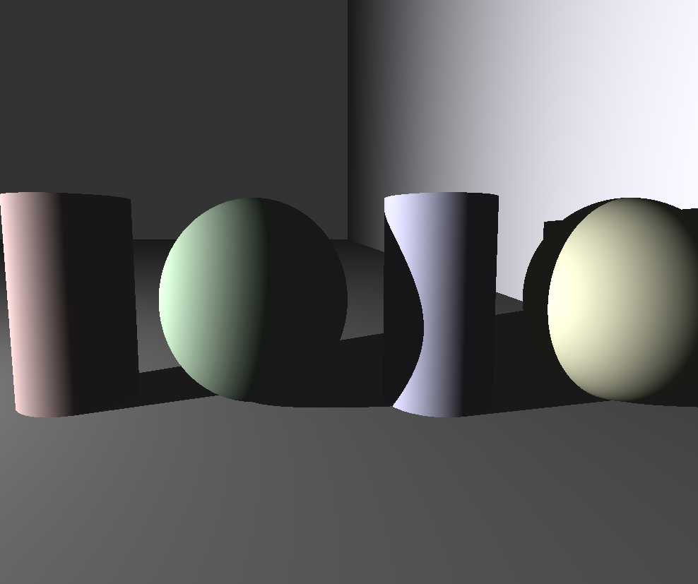
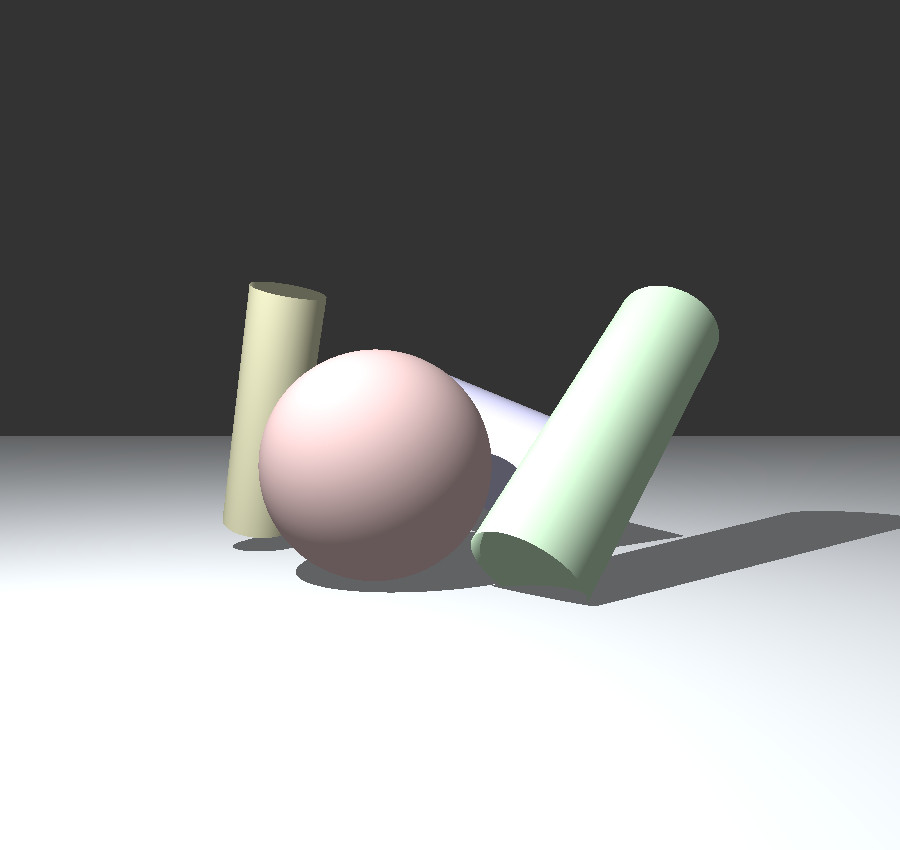
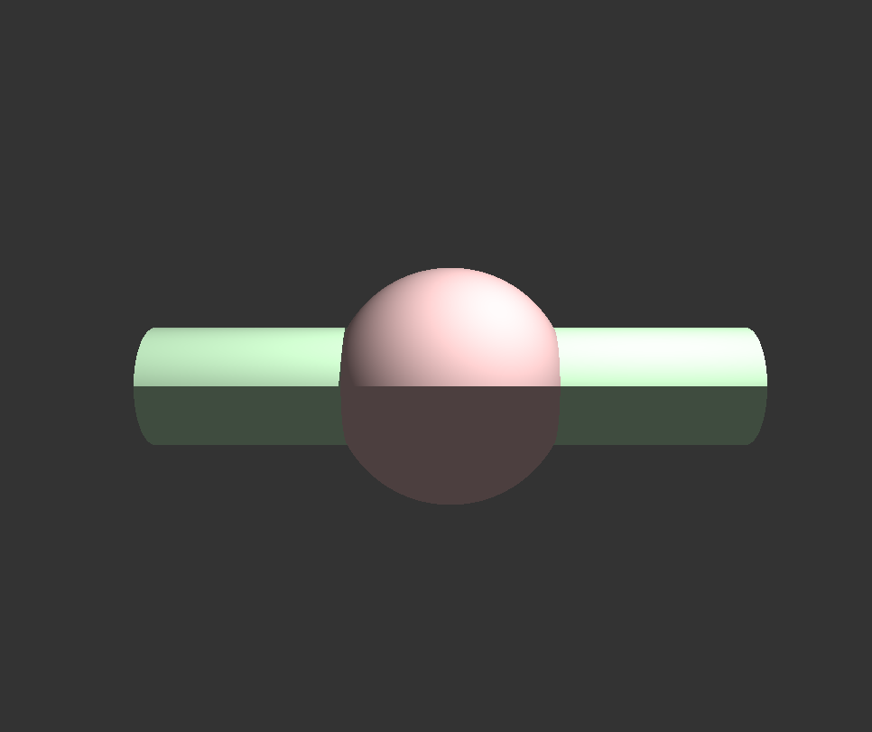
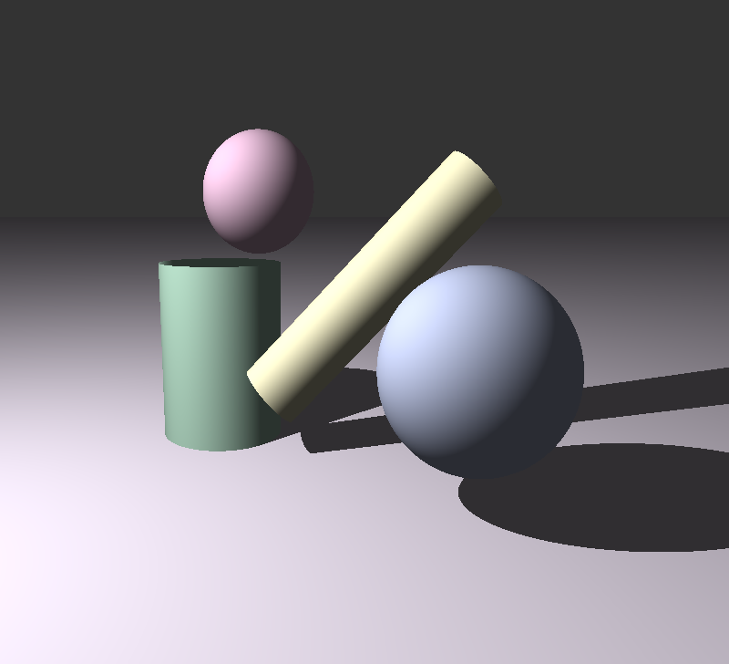
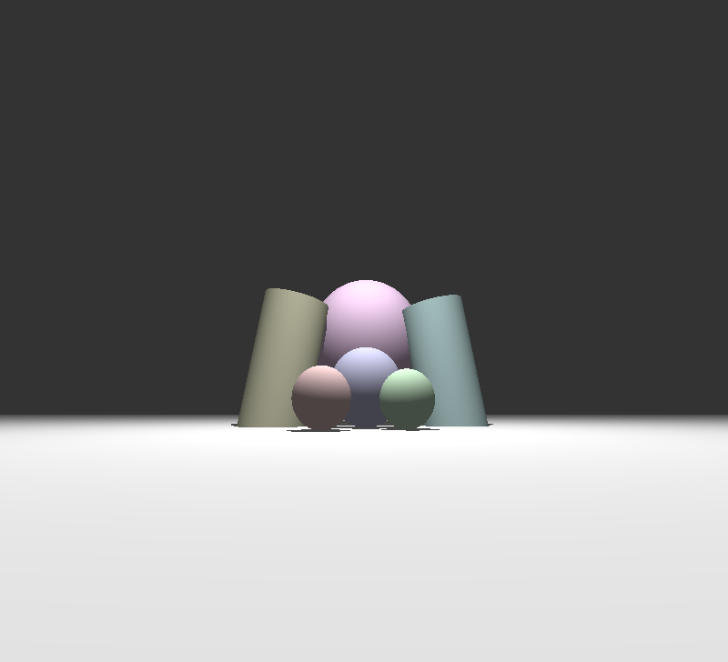
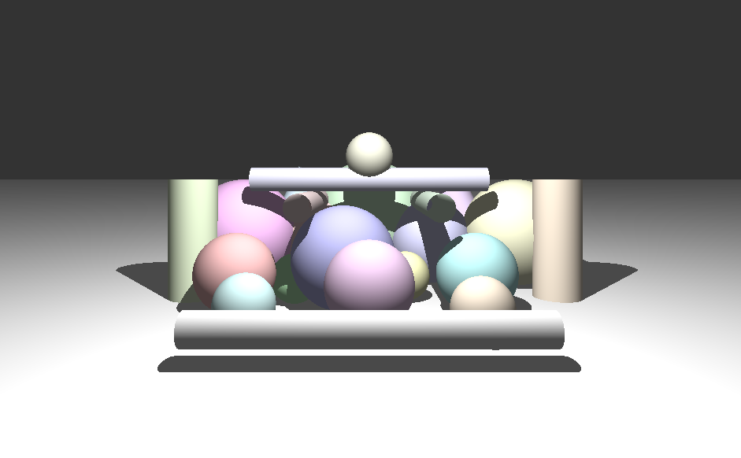
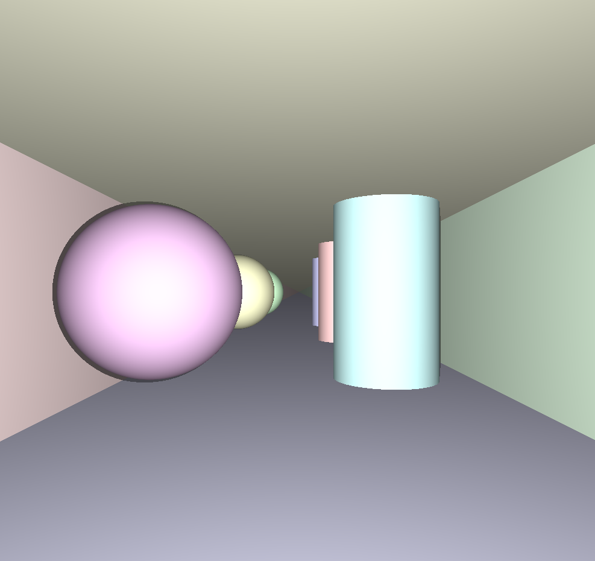
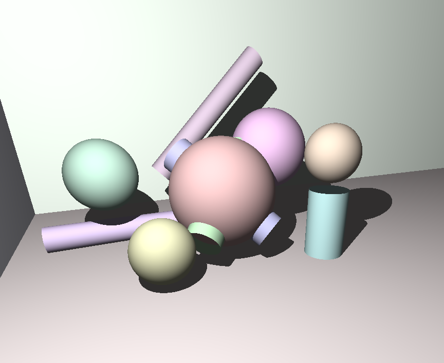

*This project has been created as part of the 42 curriculum by lrey-mol, viaremko.*

# miniRT 🕶️ 🔆


<p align="center">
  
  <br>
  <em>Showcasing crisp shadows, deep directional lighting, and multi-object intersection</em>
</p>

## Description

miniRT is our custom RayTracer written entirely in C, built using the MLX42 library. The goal of this project is to generate stunning computer-generated images by implementing the core mathematics and physics of the raytracing protocol from scratch. 

By calculating precise light paths, this program renders a 3D scene complete with geometric objects, deep shadows, and an accurate lighting system. Robustness and optimization were key priorities throughout development. The program is designed from the ground up to be completely leak-free—all heap-allocated memory is properly managed and freed. The entire codebase strictly adheres to the 42 Norm.

## Instructions

To compile and run the project, ensure you have the necessary dependencies for MLX42 installed on your system. 

A `Makefile` is provided to compile the source files using `cc` with the flags `-Wall`, `-Wextra`, and `-Werror`.

**1. Compilation**
```bash
# Compile the project and MLX42 dependencies
make
```

**2. Execution**
The program takes a scene description file (`.rt`) as its first argument.
```bash
# Run the RayTracer with a scene file
./miniRT scenes/scene_01.rt
```
*Note: You can safely exit the renderer at any time by pressing the `ESC` key or clicking the window's close button.*

## Resources

Here are the key references and documentation used to build this project:
*   [Essence of linear algebra](https://www.youtube.com/watch?v=fNk_zzaMoSs&list=PLZHQObOWTQDPD3MizzM2xVFitgF8hE_ab) - The foundational course for understanding ray and sphere intersection mathematics.
*   [MLX42 Documentation](https://github.com/codam-coding-college/MLX42) - Used for window management, pixel drawing, and event hooks.

**AI Usage:** 
AI (ChatGPT/Gemini) was used for generating boilerplate code for the README, explaining complex mathematical concepts (like quadratic equations for cylinder intersections), and helping debug specific memory leaks during the parsing phase.

---

## Implemented Features

The custom rendering engine successfully supports:

*   **Window Management:** Fluid window handling with MLX42, enabling clean rendering and smooth exits.
*   **Geometric Objects:** Flawless mathematical intersection calculations for Spheres, Planes, and Cylinders, including inside-object perspective handling.
*   **Transformations:** Accurate 3D translation and non-axis-aligned rotation applied dynamically to objects, point lights, and the camera setup.
*   **Lighting & Shadows:** A robust lighting system calculating ambient occlusion, diffuse point lighting, spot brightness, and razor-sharp hard shadows.

## Scene Configuration

The program parses a scene description file with the `.rt` extension. If any misconfiguration is encountered (syntax errors, out-of-bounds parameters, or missing values), the program safely exits and prints `Error\n` followed by an explicit error message.

The custom parser processes the following identifiers:
*   `A`: Ambient lighting ratio and RGB
*   `C`: Camera coordinates, orientation vector, and FOV
*   `L`: Point light coordinates, brightness ratio, and RGB
*   `sp`: Sphere coordinates, diameter, and RGB
*   `pl`: Plane coordinates, normal vector, and RGB
*   `cy`: Cylinder coordinates, orientation vector, diameter, height, and RGB

---

## 📸 Render Gallery

Here is a showcase of our raytracer conquering various geometric, lighting, and rendering stress tests. 

| Scene 1: Primitive Basics | Scene 2: Complex Intersections | Scene 3: Advanced Shadows |
| :---: | :---: | :---: |
|  |  |  |

| Scene 4: Extreme Camera Angles | Scene 5: High Object Density | Scene 6: Directional Lighting |
| :---: | :---: | :---: |
|  |  |  |

| Scene 7: Corridor & Planes | Scene 8: Ultimate Stress Test |
| :---: | :---: |
|  |  |
